# Monad Blitz Paris — Le projet

> Un « Subway Surfers IRL » : ton corps devient la manette, tes performances et tes récompenses rejoignent Monad.

Ce document rassemble l'idée discutée pour le hackathon. Le concept est défini ; les choix signalés comme des propositions restent à valider à deux. « Monad Blitz » est le nom utilisé dans le squelette, pas un nom de jeu définitif.

## 1. Concept

Créer un runner contrôlé par les mouvements du joueur devant une caméra. Sur l'écran, le personnage avance et des obstacles arrivent. Dans la pièce, le joueur saute, s'accroupit et se déplace à gauche ou à droite pour les éviter.

Une IA de reconnaissance corporelle transforme les mouvements filmés en commandes de jeu. Le joueur accumule un score et ramasse des pièces. Le score est enregistré sur Monad et les pièces permettent d'acheter des skins pour personnaliser le personnage.

La boucle centrale est : **bouger → éviter les obstacles → gagner des pièces → améliorer son score → acheter un skin → rejouer**.

## 2. Contexte et objectif

- Hackathon Monad Blitz Paris, avec une équipe de deux personnes.
- Une expérience dans le navigateur, avec une webcam et un écran devant le joueur.
- Une démo immédiatement compréhensible, que le jury et les autres participants peuvent essayer.
- Un premier objectif concret : terminer une partie contrôlée avec le corps, enregistrer son résultat, puis utiliser ses pièces dans la boutique.

La priorité est la qualité des commandes corporelles. Si le jeu répond mal aux mouvements, les autres fonctionnalités ne suffiront pas à rendre la démo convaincante.

## 3. Parcours du joueur

Parcours proposé pour le MVP :

1. Ouvrir le site et accéder à l'écran de lancement.
2. Autoriser la caméra et se placer entièrement dans le cadre.
3. Effectuer une courte calibration debout, au centre.
4. Lancer la partie après un compte à rebours.
5. Éviter les obstacles et collecter les pièces avec ses mouvements.
6. Voir son score et les pièces obtenues sur l'écran de fin.
7. Connecter son wallet, s'il ne l'est pas déjà, et enregistrer le résultat selon le parcours de validation retenu.
8. Consulter le classement, acheter un skin et relancer une partie.

Les interactions avec le wallet doivent se produire en dehors de la phase de jeu. Le moment exact de la connexion, avant la partie ou avant l'enregistrement, reste à décider avec le mécanisme de validation des résultats.

## 4. Gameplay

### Commandes

| Mouvement réel | Action dans le jeu |
| --- | --- |
| Déplacement vers la gauche | Aller dans le couloir de gauche |
| Retour au centre | Revenir dans le couloir central |
| Déplacement vers la droite | Aller dans le couloir de droite |
| Saut | Franchir un obstacle bas |
| Accroupissement | Passer sous un obstacle haut |

Trois couloirs constituent le format recommandé pour le prototype. La course vers l'avant est automatique : le joueur reste dans sa zone devant la caméra.

### Obstacles et difficulté

- Obstacles bloquant un couloir, à contourner.
- Obstacles bas, à franchir en sautant.
- Obstacles hauts, à éviter en s'accroupissant.
- Pièces disposées sur le parcours pour encourager les changements de trajectoire.
- Difficulté progressive, avec une vitesse et une fréquence d'obstacles croissantes.

Les séquences doivent rester réalisables : éviter les obstacles incompatibles ou trop rapprochés pour un mouvement physique. Les règles de collision, le nombre de vies et la durée des parties restent à fixer. Des parties courtes sont recommandées pour faire tourner les joueurs pendant la démo.

### Retour visuel

L'écran doit rendre lisibles le personnage, les obstacles, le score et les pièces. Un petit aperçu de la caméra avec les points du corps peut aider à comprendre la détection et à se repositionner.

En cas de perte du suivi, le comportement proposé est de mettre le jeu en pause et d'indiquer au joueur comment revenir dans le cadre.

## 5. Reconnaissance corporelle

Approche recommandée : utiliser un modèle de pose existant, puis des règles simples pour interpréter ses points corporels. [MediaPipe Pose Landmarker](https://developers.google.com/edge/mediapipe/solutions/vision/pose_landmarker/web_js) est la piste proposée, encore à intégrer et à tester sur le matériel de la démo.

Le traitement vidéo serait effectué localement dans le navigateur. L'architecture proposée ne prévoit ni stockage ni envoi du flux vidéo au serveur.

Points à travailler dans le prototype :

- Calibrer une position neutre pour adapter les seuils à chaque joueur.
- Déduire le couloir à partir du déplacement latéral du corps.
- Combiner plusieurs points et leur évolution dans le temps pour distinguer un saut d'un simple mouvement du buste.
- Détecter l'accroupissement à partir de la posture et de la hauteur relative du corps.
- Lisser les petites variations et éviter qu'un seul geste produise plusieurs commandes.
- Vérifier que les commandes gauche/droite correspondent au ressenti du joueur avec l'aperçu en miroir.
- Préserver la fluidité du rendu pendant l'analyse des images.

Le premier prototype doit valider ces quatre commandes avant d'investir dans des décors ou des animations complexes.

## 6. Score, pièces et skins

### Score

Le score représente la performance de la partie. Une progression selon la durée de survie ou la distance parcourue est proposée ; la formule exacte et les éventuels bonus restent à définir.

Le joueur doit pouvoir comparer son résultat à son meilleur score et au classement des autres participants.

### Pièces

Les pièces sont ramassées pendant la partie et servent de monnaie de jeu pour la boutique. Elles sont distinctes du score : une meilleure performance et un solde dépensable répondent à deux usages différents.

Proposition pour le MVP : enregistrer le solde dans le contrat du jeu, sans créer de token échangeable séparé. Les pièces d'une partie sont créditées une seule fois, lors de la validation de son résultat.

### Skins

Les skins modifient l'apparence du personnage. Pour le prototype, ils seraient uniquement cosmétiques, avec quelques variantes et des prix fixes.

L'inventaire peut être associé à l'adresse du joueur dans le contrat. Le choix entre de simples identifiants de skins débloqués et des NFT reste ouvert ; des NFT ne sont pas nécessaires pour démontrer l'achat et l'équipement d'un skin.

## 7. Rôle de Monad

Répartition recommandée :

| Dans le navigateur | Sur Monad |
| --- | --- |
| Caméra et reconnaissance des mouvements | Enregistrement des résultats validés |
| Simulation du jeu et collisions | Meilleur score par joueur |
| Calcul provisoire du score et des pièces | Solde de pièces et achats |
| Rendu, animations et interface | Inventaire des skins |

Une transaction à la fin de la partie peut enregistrer le résultat et créditer les pièces. L'achat d'un skin constitue une autre transaction. Les mouvements individuels n'ont pas besoin de transactions.

Le classement peut être construit à partir des résultats et événements du contrat, avec une lecture ou une indexation adaptée au nombre de joueurs.

La valeur mise en avant est la persistance publique des résultats et de l'inventaire lié au wallet. La proposition actuelle n'exige pas à elle seule les performances spécifiques de Monad : cet argument reste à préciser dans le pitch.

## 8. Validation des résultats et confiance

**Un score enregistré sur la blockchain ne prouve pas que le joueur a réellement exécuté les mouvements.** Le navigateur est modifiable et peut transmettre des résultats fabriqués.

Approche proposée pour le hackathon : un serveur de confiance vérifie la cohérence d'une session avant de signer un résultat que le contrat accepte.

- Identifier chaque partie avec un identifiant unique.
- Contrôler côté serveur la durée, les limites de score et les pièces possibles.
- Lier l'autorisation au joueur, à la partie, au score, aux pièces, au réseau et au contrat concernés.
- Empêcher la réutilisation d'une même partie pour recevoir plusieurs récompenses.
- Conserver toute clé de signature uniquement côté serveur.

Ces contrôles limitent certains abus mais ne prouvent pas l'authenticité du flux caméra. Un serveur qui signe simplement les valeurs envoyées par le navigateur ne résout pas le problème.

L'interface doit distinguer le résultat local, une transaction en attente et un résultat confirmé. En cas d'échec réseau ou de refus du wallet, l'enregistrement doit pouvoir être retenté sans créditer deux fois les pièces.

## 9. Architecture envisagée

```mermaid
flowchart LR
    Camera[Webcam] --> Pose[Estimation de pose locale]
    Pose --> Controls[Interprétation des mouvements]
    Controls --> Game[Runner dans le navigateur]
    Game --> Result[Résultat provisoire]
    Result --> API[API de validation proposée]
    API --> Signed[Résultat signé]
    Signed --> Wallet[Wallet du joueur]
    Wallet --> Monad[Contrat sur Monad]
    Monad --> UI[Classement et boutique]
```

| Partie | Choix ou état |
| --- | --- |
| Application web | Nuxt 4, Vue 3 et TypeScript, déjà en place |
| Styles | Tailwind CSS 4, déjà en place |
| Dépendances | pnpm uniquement |
| Environnement | Node.js 24 |
| Hébergement visé | Vercel, relié au dépôt GitHub |
| Reconnaissance corporelle | MediaPipe proposé, à valider |
| Rendu du jeu | À choisir selon la direction visuelle et le temps disponible |
| API de validation | Routes serveur Nuxt proposées, à implémenter |
| Wallet et contrat | Intégration à choisir et à implémenter |

## 10. Périmètre recommandé pour le MVP

- Un seul joueur, une caméra et trois couloirs.
- Les quatre commandes corporelles fiables.
- Un parcours avec obstacles, collisions et difficulté progressive.
- Collecte de pièces et écran de résultat.
- Connexion d'un wallet et enregistrement d'une partie sur Monad.
- Un classement simple.
- Une boutique avec quelques skins, achat et équipement.

À envisager après cette boucle complète : multijoueur en temps réel, tournois, nouveaux environnements, marketplace de skins et détection de fraude plus avancée.

## 11. Répartition proposée à deux

| Personne | Responsabilité principale |
| --- | --- |
| Développeur A | Caméra, calibration, reconnaissance des mouvements et moteur de jeu |
| Développeur B | Contrat, validation des résultats, wallet, classement et boutique |
| Ensemble | Interface commune, intégration, essais physiques et préparation de la démo |

Définir tôt le format des commandes de jeu et du résultat de partie pour permettre aux deux parties d'avancer indépendamment.

## 12. Ordre de réalisation

1. **Socle web et déploiement** : ouvrir la page du squelette sur une URL Vercel et vérifier sa mise à jour après un push sur `main`.
2. **Commandes corporelles** : afficher et vérifier gauche, droite, saut et accroupissement avec la caméra réelle.
3. **Runner jouable** : compléter une partie avec obstacles, score et pièces.
4. **Parcours blockchain minimal** : enregistrer un résultat et relire les données associées au joueur.
5. **Boutique et classement** : acheter un skin avec les pièces gagnées, l'équiper et afficher les scores.
6. **Démo complète** : tester l'ensemble avec les deux membres de l'équipe et des conditions de cadrage différentes.

## 13. Démo cible

Un participant se place devant l'écran, effectue la calibration et joue une courte partie. Le public voit ses mouvements contrôler le personnage. À la fin, son résultat est enregistré sur Monad, son classement apparaît et ses pièces lui permettent d'acheter un skin visible lors de la partie suivante.

La démo doit montrer cette boucle complète, avec un retour clair à chaque étape.

## 14. État actuel et décisions restantes

Le dépôt contient le squelette Nuxt + Tailwind, une page d'accueil, la configuration TypeScript et pnpm, ainsi que la configuration du runtime Vercel. Le contrôle TypeScript et la génération du build Vercel ont été vérifiés localement.

Le jeu, la caméra, le wallet, les contrats et la boutique ne sont pas encore implémentés. La connexion effective du dépôt à Vercel et le déploiement automatique restent à vérifier dans les services concernés.

Décisions à prendre :

- Nom définitif et direction visuelle du jeu.
- Rendu 2D, en perspective ou 3D.
- Matériel, cadrage et distance de jeu pour la démo.
- Règles de score, collisions, durée et difficulté.
- Réseau Monad cible et solution de connexion du wallet.
- Validation des sessions et niveau de confiance assumé.
- Prix des skins, règles des pièces et représentation de l'inventaire.
- Répartition nominative et temps disponible.
